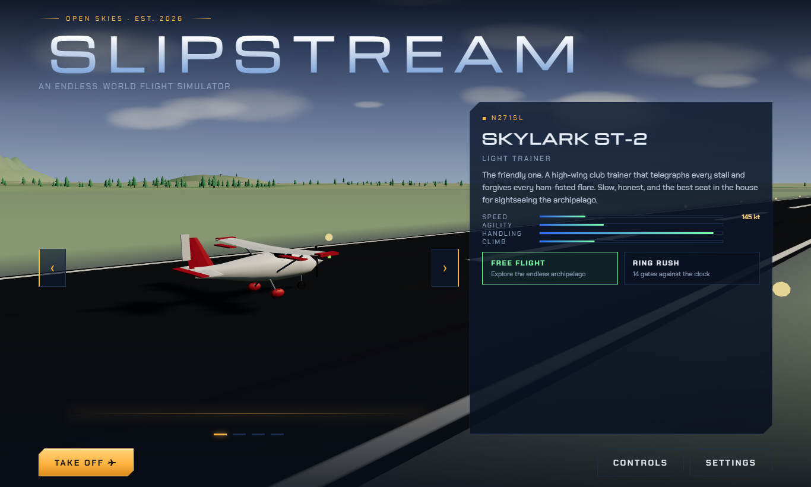
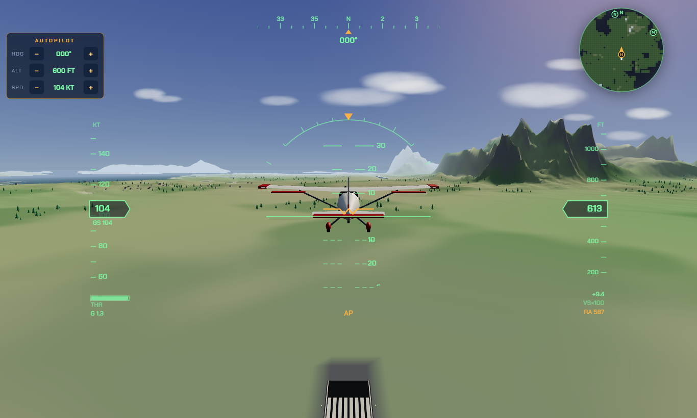

# ✈ SLIPSTREAM

An endless-world flight simulator that runs entirely in the browser — desktop and mobile.
Four aircraft with genuinely different flight models, an infinite procedurally generated
archipelago, a glass-cockpit HUD, a time-trial ring course, and a fully procedural
soundscape. No model files, no textures, no audio assets: everything is generated at runtime.




## Quick start

```bash
npm install
npm run dev       # local dev server (LAN-exposed for phone testing)
npm run build     # type-check + production bundle in dist/
npm run preview   # serve the production build
npm test          # headless physics/world test suite (no browser needed)
```

Dependencies are exactly three, pinned: `three`, `vite`, `typescript` (+ `@types/three`).

## Flying

| Control | Keys |
| --- | --- |
| Pitch / Roll | `W S` / `A D` (or arrows) |
| Rudder | `Q` / `E` |
| Throttle | `Shift` / `Ctrl`, presets `1–9`, `0` = idle |
| Flaps / Gear | `F` & `V` / `G` |
| Wheel brakes / **fire cannon** (airborne, Vector) | `Space` (hold) |
| Speed brake (jets) | `B` |
| Autopilot (alt + hdg + speed hold) | `T` — any stick input disengages |
| Autopilot bugs | on-screen panel, or `[` `]` heading · `PgUp` `PgDn` altitude · `Home` `End` speed |
| Camera (chase / cockpit / orbit) | `C` |
| Look around / zoom | mouse drag / wheel (recentres on release) |
| HUD full / minimal / off | `H` |
| Minimap on/off | `M` |
| Pause | `Esc` or `P` |
| Restart flight | `R` |

On touch devices: left virtual stick (pitch/roll), right throttle lever (stays where you
set it), rudder pedals bottom-centre, hold-to-brake, and gear/flap/camera buttons.

**Takeoff:** full throttle, one notch of flaps, rotate gently past the middle of the
speed tape. If `STALL` flashes — nose down, power up.

### The fleet

| Aircraft | Character |
| --- | --- |
| **Skylark ST-2** | Forgiving high-wing trainer. Slow, stable, lands anywhere. |
| **Falcon Mk.IV** | WWII warbird. Huge roll rate, bites in the stall, tail-dragger. |
| **Vector V-25** | Delta-wing fighter. Afterburner at 100% throttle, 900+ kt, internal cannon — pop the target balloons east of Meridian Field. |
| **Meridian 700** | 16-tonne executive jet. Stately, fast in cruise, needs planning. |

Each one is parameterised physically (mass, wing area, lift slope, stall angle, drag,
thrust model) — the handling differences fall out of the numbers, not scripts.

### Modes

- **Free Flight** — explore. The world streams in around you forever: coasts, forests,
  settlements, snow-capped ranges. The home cluster has three airfields — **Meridian
  Field** (spawn, 2.4 km runway), **Northgate Strip** and **Highmoor Field** — and
  beyond them, procedural strips appear every ~15–25 km of land, deterministically
  seeded so they're always in the same place. The minimap marks every runway and
  always points the way home.
- **Ring Rush** — 14 gates against the clock. Best time per aircraft is saved locally.

## Engineering notes

- **Terrain** is an analytic heightfield (domain-warped FBM + ridged multifractal,
  seeded simplex). The render mesh, tree/settlement scattering *and* collision all sample
  the same function, so what you see is exactly what you hit. Chunk generation runs in a
  **Web Worker** — payloads arrive as transferable typed arrays, so the main thread never
  hitches while streaming nested-LOD chunks around the aircraft. Every LOD swap
  **geomorphs**: a chunk's vertices start on the exact surface they replace (the coarser
  chunk, or the horizon shell) and swell to full detail over a second, so terrain never
  pops. Beneath the chunk ring a
  single coarse **horizon shell** (~60 km of the same heightfield, built as a conservative
  lower envelope) carries the terrain to the horizon; the fog opens up with altitude, so
  from 10,000 ft you see fading coastlines instead of the edge of the streamed grid.
- **Flight model**: real force integration — CL(α) curve with post-stall falloff, induced
  drag from aspect ratio, sideslip weathervaning, control authority scaling with dynamic
  pressure, air density falling with altitude, ground roll with brakes/steering and crash
  detection (sink rate, attitude, slope, water). Per-aircraft G-limits cap pitch authority
  at speed, the fighter has a fly-by-wire alpha limiter, and weathervane stability stiffens
  with true airspeed so high-Mach flight stays honest. Engines spool (jets take seconds to
  wind up), ground effect floats the flare, prop torque wants right rudder on takeoff, and
  light low-altitude turbulence keeps cruise alive.
- **Audio** is synthesized WebAudio: prop firing tone, jet spool noise, wind that swells
  with airspeed, stall beeper, touchdown thumps.
- **Quality presets** (low/med/high) scale pixel ratio, shadows, view distance and cloud
  count; the default is picked from device class.

### Dev/test URL parameters

- `?autofly=1` — autopilot takes off and climbs (demo / smoke test; telemetry in the tab title)
- `&ff=60` — fast-forward N seconds of physics before the first frame
- `&ac=vector` — select aircraft (`skylark`, `falcon`, `vector`, `meridian`)
- `&mode=race` — start in Ring Rush
- `&touch=1` — force the touch UI on desktop
- `&apt=1` — spawn at another fixed airfield (1 = Northgate, 2 = Highmoor)
- `&ap=1` — engage the autopilot after the fast-forward

## Deploying

The site is fully static (`npm run build` → `dist/`) and deploys on Cloudflare Pages
(build command `npm run build`, output `dist`). Two lockfile rules keep `npm ci` green
on Cloudflare's **npm 10.9.2**:

1. **After changing dependencies**, regenerate the lockfile with Cloudflare's npm —
   npm 11 builds a different ideal tree that npm 10 rejects:
   `npx -y npm@10.9.2 install --package-lock-only --ignore-scripts`
2. **Before committing, check `git status package-lock.json`.** A cold-cache `npx` run
   (npm 11) can silently *prune* the top-level `@emnapi/core` / `@emnapi/runtime`
   entries (~26 lines) that npm 10 requires. If the lockfile shrank and you didn't
   change dependencies, restore it: `git checkout HEAD -- package-lock.json`.
   (The test runner calls the local `tsc` directly rather than `npx tsc` for this
   reason.)
